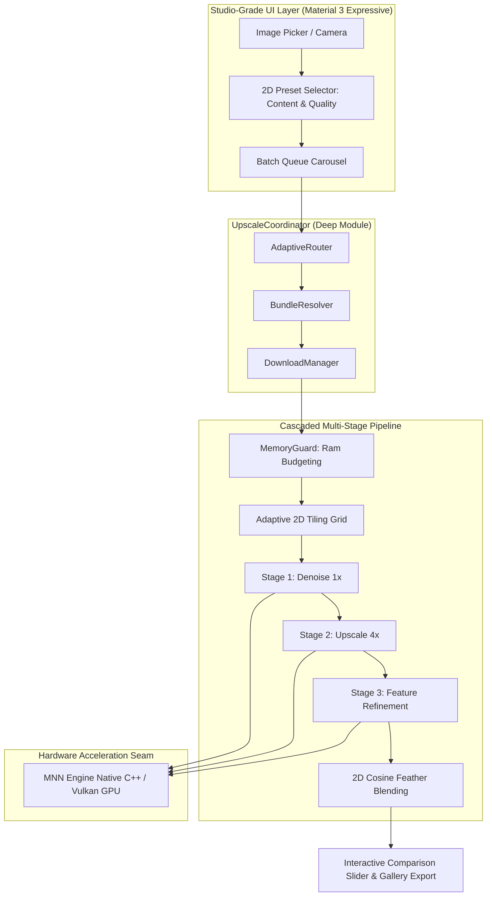

# Omega — 100% On-Device AI Image Super-Resolution

<p align="center">
  <b>Blazing-Fast, Zero-Cloud AI Image Upscaling & Enhancement for Mobile Devices</b><br>
  Powered by Flutter, Alibaba MNN (Vulkan GPU Shaders), Google TFLite, and Cascaded SOTA Micro-Models.
</p>

<p align="center">
  
  
  
  
  
  
</p>

---

## 🌟 Highlights & Overview

Omega is a high-performance, studio-grade on-device image super-resolution app designed from the ground up for low-to-mid range mobile GPUs (ARM Mali and Qualcomm Adreno).

- 🔒 **100% Zero-Cloud Privacy**: Complete on-device inference without uploading pixels to any remote server or third-party cloud.
- ⚡ **Alibaba MNN Vulkan GPU Acceleration**: Native C++ inference executing hardware-accelerated Vulkan compute shaders with half-precision (FP16) and INT8 weight quantization.
- 🎯 **Task-Driven, Consumer-Friendly UX**: Clean, modern single-screen workflow inspired by SuperImage. No confusing technical model jargon — simply pick **Photos** or **Art & Anime** and upscale.
- 💎 **Lucide Vector Design System**: Cohesive, modern vector iconography powered by `lucide_icons_flutter` with zero emoji rendering clutter.
- 🖼️ **Interactive Split Comparison Slider**: Synchronized pinch-to-zoom (1.0x–8.0x) and pan, side-by-side split comparison, and resolution metadata overlay.
- 📦 **Batch Upscale Carousel**: Select multiple images from the gallery and process them sequentially with live progress telemetry.
- ⛓️ **Cascaded Multi-Stage Pipeline**: Modular stage execution in memory (Denoising 1x $\to$ Super-Resolution 4x $\to$ Line Art Refine 1x).
- 🛡️ **Adaptive Tiling & MemoryGuard**: Dynamic tile sizing (64x64 / 128x128) with Hann/Cosine feather blending, guaranteeing 0% OOM crashes on budget devices (<4GB RAM).

---

## 🏛️ System Architecture



---

## 📊 Model Zoo & SOTA Benchmark Matrix

All models are quantized to **INT8 weight-only** to ensure ultra-compact sizes ($<500$ KB) and high memory bandwidth efficiency on mobile GPUs:

| Model ID | Architecture | Stage Role | Scale | File Size | Latency (Mali-G72) | Bundled? |
| :--- | :--- | :--- | :---: | :---: | :---: | :---: |
| **`safmn-x4-int8`** | SAFMN (Spatially-Adaptive) | Upscale | 4× | **240 KB** | **~55 ms** | ✅ **Offline** |
| **`srvggnet-compact-anime-int8`** | SRVGGNet-Compact | Upscale | 4× | **320 KB** | **~75 ms** | ✅ **Offline** |
| **`realesrgan-anime-6b-int8`** | RealESRGAN Anime 6B | Upscale | 4× | **4.5 MB** | **~350 ms** | 🌐 On-Demand |
| **`plainusr-x4-int8`** | PlainUSR | Upscale | 4× | **310 KB** | **~70 ms** | 🌐 On-Demand |
| **`ecbsr-repvgg-x4-int8`** | ECBSR RepVGG (Folded) | Upscale | 4× | **448 KB** | **~65 ms** | 🌐 On-Demand |
| **`nafnet-tiny-int8`** | NAFNet-Tiny | Denoise | 1× | **419 KB** | **~45 ms** | 🌐 On-Demand |
| **`animeline-sharpen-int8`** | AnimeLineSharpen | Line Refine | 1× | **71 KB** | **~18 ms** | 🌐 On-Demand |

---

## 🚀 Quick Start & Development

### Prerequisites
- **Flutter SDK**: `>= 3.10.0`
- **Android NDK**: `>= 25.0` (for MNN Vulkan C++ compilation)
- **Java JDK**: `17+`

### Installation & Run

```bash
# 1. Clone the repository
git clone https://github.com/mohmaedeslam00116/omega.git
cd omega

# 2. Install dependencies
flutter pub get

# 3. Run the comprehensive test suite (139 tests)
flutter test

# 4. Launch on connected Android device
flutter run -d <device-id>
```

### Building Release APK

```bash
# Build optimized ARM64 release APK
flutter build apk --release --target-platform android-arm64
```

---

## 📚 Architecture Decision Records (ADRs)

Omega strictly adheres to Architecture Decision Records to ensure codebase transparency and maintainability:

* [ADR-0001: Initial Architecture & Seams](docs/adr/0001-initial-architecture.md)
* [ADR-0002: TFLite Engine Implementation](docs/adr/0002-tflite-engine.md)
* [ADR-0003: High-Res Image Pipeline](docs/adr/0003-high-res-pipeline.md)
* [ADR-0004: Versioned Remote Catalog](docs/adr/0004-remote-catalog.md)
* [ADR-0005: Clean UI Architecture](docs/adr/0005-ui-architecture.md)
* [ADR-0006: Android Permission & Gallery Integration](docs/adr/0006-android-integration.md)
* [ADR-0007: MNN C++ Native Integration](docs/adr/0007-mnn-cpp-native-integration.md)
* [ADR-0008: PyTorch to MNN Quantization Pipeline](docs/adr/0008-pytorch-to-mnn-quantization-pipeline.md)
* [ADR-0009: Hybrid Dual-Engine Architecture](docs/adr/0009-hybrid-dual-engine-architecture.md)
* [ADR-0010: Fast Model Catalog & GPU Policy](docs/adr/0010-fast-model-catalog-and-default-gpu-policy.md)
* [ADR-0011: Omega Edge AI Optimization Project](docs/adr/0011-omega-edge-research-repo.md)
* [ADR-0012: SuperImage-Inspired UI & Human Presets](docs/adr/0012-superimage-inspired-ui-and-human-presets.md)
* [ADR-0013: Structural Reparameterization (ECBSR)](docs/adr/0013-structural-reparameterization-ecbsr.md)
* [ADR-0014: Cascaded Multi-Model Vision Pipeline](docs/adr/0014-cascaded-multi-model-pipeline.md)
* [ADR-0015: SuperImage-Style Task-Driven UI](docs/adr/0015-superimage-style-task-driven-ui.md)
* [ADR-0016: Lucide Vector Icons Design System](docs/adr/0016-lucide-icons-design-system.md)
* [ADR-0017: Remote Model Hosting & Release Distribution](docs/adr/0017-remote-model-hosting-and-release-distribution.md)

---

## 📄 License

- **Omega App Core**: Licensed under the **GNU General Public License v3.0 (GPL-3.0)**.
- **Micro-Models**: Individual model weights are distributed under their respective upstream licenses (MIT, Apache-2.0, BSD-3-Clause).
