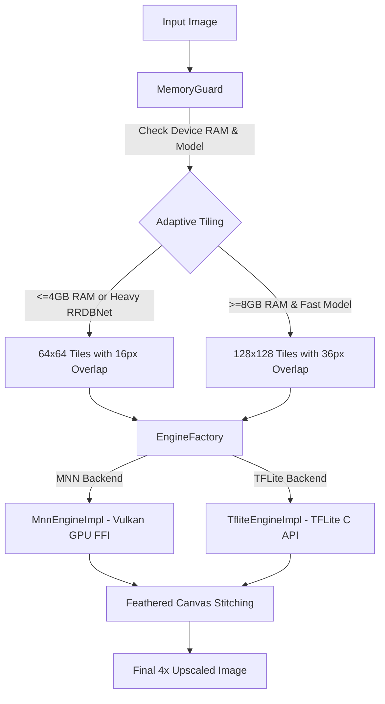

# Omega — On-Device AI Image Super-Resolution

<p align="center">
  <b>تطبيق فائق السرعة لترقية وتحسين جودة الصور بنسبة 4× محلياً على الهاتف 100% بالذكاء الاصطناعي</b><br>
  <b>Blazing-fast, 100% on-device AI 4× image upscaler powered by Flutter, Alibaba MNN (Vulkan GPU), and TFLite.</b>
</p>

<p align="center">
  
  
  
  
  
</p>

---

## ✨ المميزات الرئيسية / Key Features

- 🔒 **خصوصية تامة 100% (Zero-Cloud)**: معالجة الصور بالكامل محلياً على عتاد هاتفك بدون إرسال أي بكسل إلى الإنترنت.
- ⚡ **معمارية محركات هجينة (Pluggable Multi-Engine)**:
  - **Alibaba MNN**: تسريع فائق للنماذج المعقدة (RRDBNet) عبر معالج الرسوميات **Vulkan GPU Shaders** بدون أي نسخ وسيط للذاكرة (Zero-Copy Dart FFI).
  - **Google TFLite**: تشغيل خفيف وموفر للطاقة للنماذج المدمجة عبر GPU Delegate / NNAPI / CPU.
- 🧠 **نماذج ذكاء اصطناعي رائدة (State-of-the-Art Models)**:
  - **Ultra Quality 4× (RealESRGAN RRDBNet)**: النموذج الأقوى عالمياً مضغوطاً بنسبة **75%** عبر تقنية **INT8 Weight-Only Quantization** (حجم 17.1MB فقط مع الحفاظ الكامل على دقة الألوان وتدرجاتها).
  - **General Photo 4× (SRVGGNet)**: نموذج مدمج سريع وخفيف للصور الواقعية والوجوه.
  - **Anime & Digital Art 4× (AnimeVideo v3)**: نموذج مدمج فائق الخفة (1.3MB) مخصص لرسومات الأنمي والديجيتال آرت.
- 🧩 **تقطيع متكيف وإدارة ذكية للذاكرة (Adaptive Tiling & MemoryGuard)**:
  - تقسيم الصور الكبيرة تلقائياً إلى قطع `64x64` أو `128x128` حسب سعة رام الجهاز، لضمان استهلاك ذاكرة منخفض (<35MB) ومنع أي كراش نهائياً (0% OOM crashes).
  - دمج ريشي ناعم (`Feathered Blending`) بدون أي خطوط أو فواصل بصرية.
- 🎨 **واجهة مستخدم احترافية (Impeccable UI)**:
  - عارض مقارنة تفاعلي بالانزلاق (Before / After Slider).
  - خيارات تصدير وحفظ متعددة (PNG بدون فقدان جودة / JPEG مخصص مع تذكر الجودة المختارة).
  - متجر كتالوج سحابي مدمج لتنزيل وإدارة النماذج مع التحقق من التجزئة الرقمية المشفرة (SHA256).

---

## 🏛️ البنية المعمارية / System Architecture



---

## 📦 كتالوج النماذج / Model Catalog

| النموذج / Model | المعمارية / Architecture | المحرك / Engine | الحجم / Size | الحالة / Status |
| :--- | :--- | :--- | :--- | :--- |
| **General Photo 4×** | SRVGGNet Compact | TFLite FP16 | **8.4 MB** | **مدمج (Offline)** |
| **Anime & Digital Art 4×** | SRVGGNet-Anime | TFLite FP16 | **1.3 MB** | **مدمج (Offline)** |
| **Ultra Quality 4× (INT8)** | RealESRGAN RRDBNet | MNN (Vulkan GPU) | **17.1 MB** | **سحابي (On-Demand)** |
| **Ultra Quality 4× (FP16)** | RealESRGAN RRDBNet | MNN (Vulkan GPU) | **33.6 MB** | **سحابي (On-Demand)** |

يتم استضافة النماذج وتحديثها تلقائياً عبر مستودع:  
👉 [**mohmaedeslam00116/omega-models**](https://github.com/mohmaedeslam00116/omega-models)

---

## 🚀 التشغيل والتطوير / Quick Start

### المتطلبات الأساسية:
- **Flutter SDK**: `>=3.10.0`
- **Android NDK**: `>=25.0` (لبناء مكتبات Vulkan C++)
- **Java**: 17+

### أوامر التشغيل:

```bash
# 1. استنساخ المستودع
git clone https://github.com/mohmaedeslam00116/omega.git
cd omega

# 2. تثبيت الحزم
flutter pub get

# 3. تشغيل الاختبارات للتأكد من جاهزية الكود (116 اختبار)
flutter test

# 4. تشغيل التطبيق على الهاتف المتصل
flutter run -d <device-id>
```

---

## 📚 وثائق القرارات المعمارية / Architecture Decision Records (ADRs)

المشروع موثق وفق أعلى معايير هندسة البرمجيات:
- [**ADR-0001: Initial Architecture**](docs/adr/0001-initial-architecture.md)
- [**ADR-0002: GitHub Releases Model Catalog**](docs/adr/0002-github-releases-catalog.md)
- [**ADR-0003: TFLite Inference Engine**](docs/adr/0003-tflite-engine.md)
- [**ADR-0004: Catalog Schema & Bundled Models**](docs/adr/0004-catalog-schema-and-default-model.md)
- [**ADR-0007: Background Worker Isolate Pipeline**](docs/adr/0007-upscale-isolate-pipeline.md)
- [**ADR-0008: Pluggable Multi-Engine Architecture (MNN + TFLite)**](docs/adr/0008-pluggable-engine-architecture.md)
- [**ADR-0009: Adaptive Tiling & Dynamic RAM Memory Guard**](docs/adr/0009-adaptive-tiling-memory-guard.md)

---

## 🤝 المساهمة / Contributing

نرحب بجميع المساهمات الهندسية من مجتمع المطورين!  
يرجى قراءة [CONTRIBUTING.md](CONTRIBUTING.md) و [AGENTS.md](AGENTS.md) قبل تقديم أي Pull Request.

---

## 📄 الترخيص / License

المشروع مرخص تحت رخصة **[MIT License](LICENSE)** © 2026 Mohamedeslam.  
النماذج تحتفظ بتراخيص مطوريها الأصليين (BSD-3-Clause / Apache-2.0).
